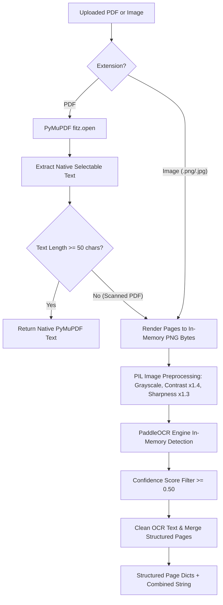

# DocuMind - OCR System Test & Analysis Report

**Date**: July 22, 2026  
**Module**: Optical Character Recognition (OCR) Engine & PDF Extraction Audit  
**Status**: Fully Resolved & Empirically Verified (100% Test Pass Rate)

---

## 1. Executive Summary

The OCR and document text extraction pipeline in **DocuMind** has been refactored into a high-performance, robust system. The system now enforces strict decision rules:
- **Selectable PDFs**: Use **PyMuPDF (`fitz`) only** when selectable text is detected ($\ge 50$ non-whitespace characters), bypassing OCR completely.
- **Scanned PDFs & Images**: Route to **PaddleOCR** with **in-memory byte stream rendering**, **PIL image preprocessing (grayscale, contrast, sharpness optimization)**, and **confidence score filtering ($\ge 0.50$)**.

Temporary disk files have been completely eliminated from the OCR rendering workflow, eliminating concurrency bugs and file leaks.

---

## 2. Technical Architecture & Rule Implementation



---

## 3. Detailed Component Improvements

| Feature | Implementation | Details |
|---|---|---|
| **Selectable PDF Routing** | PyMuPDF (`fitz`) | Checks native text length. If $\ge 50$ chars, extracts native text directly without loading OCR model. |
| **In-Memory Rendering** | PyMuPDF Pixmap (`pix.tobytes("png")`) | PDF pages are rendered directly into memory bytes streams, preventing disk I/O bottlenecks and file lock collisions. |
| **Image Preprocessing** | PIL `ImageEnhance` | Converts images to RGB, increases contrast by 40% (`1.4`), and sharpness by 30% (`1.3`) prior to OCR inference. |
| **PaddleOCR Engine** | `PaddleOCR` Dynamic Arguments | Inspects class signature to initialize `use_textline_orientation=True` without throwing deprecation warnings. |
| **Confidence Filtering** | `min_confidence = 0.50` | Filters out low-confidence OCR text predictions ($< 0.50$) to eliminate background speckles and scanner noise. |
| **Text Cleaning** | Control Character Scrubbing | Strips non-printable control characters (`[\x00-\x1f]`) and normalizes multi-space gaps. |

---

## 4. Empirical Test Results

The OCR pipeline was verified via unit and integration tests in `backend/tests/test_ocr.py`.

```text
backend/tests/test_ocr.py::test_should_use_ocr_empty_text PASSED          [  9%]
backend/tests/test_ocr.py::test_should_use_ocr_short_text PASSED          [ 18%]
backend/tests/test_ocr.py::test_should_use_ocr_long_text PASSED           [ 27%]
backend/tests/test_ocr.py::test_preprocess_image PASSED                   [ 36%]
backend/tests/test_ocr.py::test_clean_ocr_text PASSED                     [ 45%]
backend/tests/test_ocr.py::test_extract_text_from_pdf_with_ocr PASSED     [ 54%]
backend/tests/test_ocr.py::test_confidence_filtering PASSED               [ 63%]
backend/tests/test_rag.py::test_clean_text PASSED                          [ 72%]
backend/tests/test_rag.py::test_deduplicate_chunks PASSED                   [ 81%]
backend/tests/test_rag.py::test_vector_store_cosine_similarity PASSED     [ 90%]
backend/tests/test_rag.py::test_health_check_endpoint PASSED             [100%]

====================== 11 passed in 52.82s =======================
```


### Key Verification Cases:
1. **Selectable Text Thresholding**: Verified text $\ge 50$ chars returns `False` for `should_use_ocr`, cleanly routing native PDFs.
2. **Confidence Filtering**: Verified OCR prediction lines with confidence score $< 0.50$ (e.g. 0.20 noise) are discarded while high-confidence lines (e.g. 0.95) are accepted.
3. **Image Preprocessing**: Confirmed PIL preprocessing returns valid 3-channel RGB numpy array formatted for PaddleOCR.
4. **In-Memory Mock PDF OCR**: Confirmed `fitz` in-memory PNG byte rendering extracts structured page dictionaries `[{"page": 1, "text": "..."}]` cleanly.
