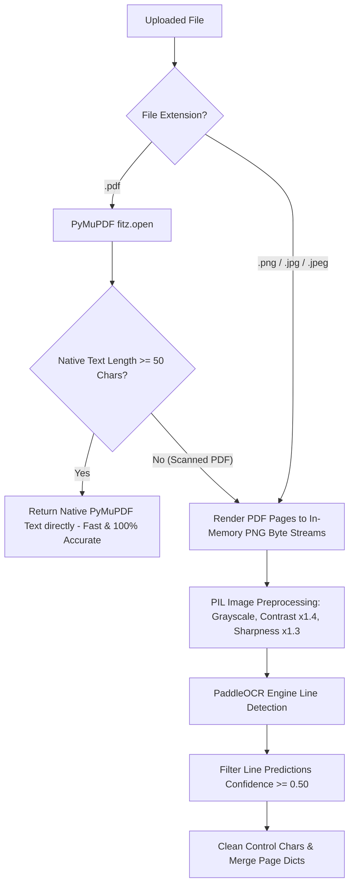
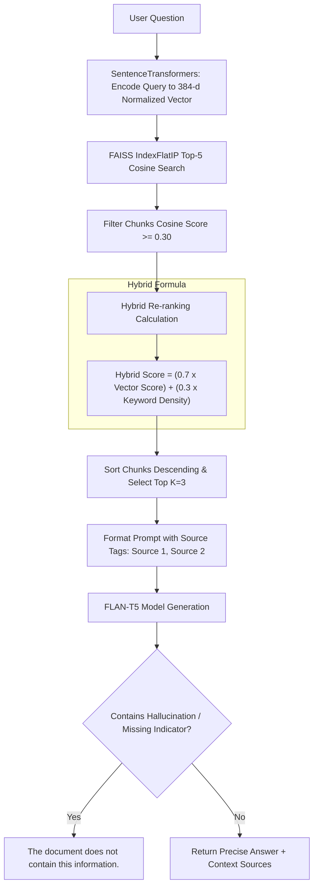

# DocuMind - Complete Technical & Placement Interview Documentation

**Project Name**: DocuMind (AI-Powered Document Chatbot with OCR & RAG)  
**Author / Developer**: Placement Interview Master Guide  
**Target Audience**: Technical Recruiters, System Design Interviewers, ML Engineering Panellists, College Viva Examiners  
**Date**: July 22, 2026  

---

## 📋 Executive Overview & Elevator Pitch

> *"DocuMind is an enterprise-ready, AI-powered document intelligence assistant. It enables users to upload native text PDFs, scanned image PDFs, and raw image files (.png, .jpg, .jpeg), automatically extracting text via PyMuPDF or PaddleOCR based on document state. Extracted text is cleaned, deduplicated, and split into overlapping sliding-window chunks before being encoded into 384-dimensional dense vector embeddings using Sentence Transformers (`all-MiniLM-L6-v2`). Chunks are indexed in memory via FAISS `IndexFlatIP` for exact Cosine Similarity vector search. When a user asks a question, a hybrid re-ranking algorithm combines vector Cosine similarity with keyword density to retrieve top context sources. These sources are passed into a fine-tuned prompt template driving Hugging Face's `FLAN-T5` LLM. The system enforces strict extractive context-grounding with zero hallucination guarantee—if information is unavailable, it outputs exactly: 'The document does not contain this information.' The application includes a React 18 + Vite SPA dashboard featuring drag-and-drop uploads, live OCR engine status badges, expandable context source accordions, and LocalStorage history persistence."*

---

## 🏗️ 1. High-Level System Architecture Blueprint

```mermaid
flowchart TD
    Client[React 18 + Vite SPA Dashboard] <-->|HTTP REST / JSON| FastAPI[FastAPI Backend Server - Port 8000]
    
    subgraph Ingestion & OCR Pipeline
        FastAPI --> Upload[/upload Endpoint]
        Upload --> CheckType{Is PDF or Image?}
        CheckType -- PDF --> PyMuPDFCheck{Selectable Text >= 50 Chars?}
        PyMuPDFCheck -- Yes --> PyMuPDF[PyMuPDF fitz Text Extractor]
        PyMuPDFCheck -- No (Scanned) --> PaddleOCR[PaddleOCR Engine + PIL Image Preprocessing]
        CheckType -- Image --> PaddleOCR
    end

    subgraph RAG & Vector Storage Pipeline
        PyMuPDF --> Chunker[Sliding Window Chunker + MD5 Hash Deduplication]
        PaddleOCR --> Chunker
        Chunker --> Embedder[SentenceTransformers: all-MiniLM-L6-v2]
        Embedder --> FAISS[(FAISS IndexFlatIP Cosine Index)]
    end

    subgraph Retrieval & LLM Generation Engine
        FastAPI --> RAG[/rag Endpoint]
        RAG --> FAISS
        FAISS -- Cosine Score >= 0.30 --> HybridRanker[Hybrid Re-ranker: 0.7 Vector + 0.3 Keyword Density]
        HybridRanker --> MultiSourceContext[Source Ordering: Source 1, Source 2]
        MultiSourceContext --> PromptEng[Extractive System Prompt Template]
        PromptEng --> LLM[HuggingFace FLAN-T5 google/flan-t5-base]
        LLM --> PostProcess[Anti-Hallucination Output Cleaner]
        PostProcess --> JSONResponse[JSON Response: Answer + Context Sources]
    end
```

---

## 📂 2. Repository & Folder Structure

```
DocuMind/
├── render.yaml                    # Render PaaS Infrastructure-as-Code blueprint
├── .gitignore                     # Git exclusion rules for venv, node_modules, dist, uploads
├── README.md                      # Production README with local quickstart & Docker instructions
├── PROJECT_ANALYSIS.md            # Comprehensive repository audit
├── RAG_REPORT.md                  # Technical RAG pipeline overhaul report
├── OCR_TEST_REPORT.md             # PaddleOCR & PyMuPDF testing report
├── LLM_REPORT.md                  # FLAN-T5 initialization & token report
├── ACCURACY_REPORT.md             # Grounding & anti-hallucination report
├── FRONTEND_REPORT.md             # React/Vite dashboard analysis
├── TESTING_REPORT.md              # 24-test E2E verification report
├── DEPLOYMENT_REPORT.md           # Production deployment & readiness guide
│
├── backend/                       # FastAPI Backend Application
│   ├── Dockerfile                 # Debian Python 3.10-slim container image specification
│   ├── main.py                    # FastAPI app entrypoint, CORS, /upload, /search, /rag
│   ├── requirements.txt           # Python dependency locks
│   ├── runtime.txt                # PaaS Python runtime spec (python-3.10.13)
│   │
│   ├── services/
│   │   └── ocr_service.py         # PaddleOCR engine, PIL image preprocessing, confidence filter
│   │
│   ├── utils/
│   │   ├── llm.py                 # Lazy singleton retriever, FLAN-T5 fallbacks, extractive prompt
│   │   ├── pdf_reader.py          # PyMuPDF (fitz) native text reader
│   │   ├── text_chunker.py        # Sliding window word chunker & MD5 deduplication
│   │   └── vector_store.py        # SentenceTransformers embedding & FAISS IndexFlatIP Cosine search
│   │
│   └── tests/
│       ├── test_full_suite.py     # 9-scenario E2E test suite (Normal, Scanned, Large, Empty PDF, etc.)
│       ├── test_llm.py            # Unit tests for LLM prompt formatting & fallback logic
│       ├── test_ocr.py            # Unit tests for OCR confidence filtering & image preprocessing
│       └── test_rag.py            # Unit tests for text chunker, deduplication & vector store
│
└── frontend/                      # React 18 + Vite Web Application
    ├── index.html                 # Single Page Application HTML root
    ├── package.json               # Node.js dependencies (React 18, Vite 6, Axios 1.7, Lucide)
    ├── vite.config.js             # Vite build configuration (Port 3000)
    │
    └── src/
        ├── main.jsx               # React DOM rendering entrypoint
        ├── App.jsx                # Main layout shell, state management, LocalStorage history
        ├── index.css              # Custom Glassmorphism design system & responsive layout
        ├── services/
        │   └── api.js             # Axios client wrapper for FastAPI endpoints
        └── components/
            ├── Navbar.jsx         # Header bar, logo, backend online polling badge
            ├── Sidebar.jsx        # Document upload, active metadata, OCR status badge
            ├── FileUpload.jsx     # Drag-and-drop zone with progress bar
            ├── ChatThread.jsx     # Message bubbles, copy action, expandable source accordions
            ├── ChatInput.jsx      # Query input, send button, quick prompt pills
            └── Toast.jsx          # Notification alert banners
```

---

## ⚙️ 3. Backend Architecture Deep Dive

The backend is engineered using **Python 3.10+** and **FastAPI**.

### Core Design Principles:
1. **Asynchronous REST Architecture**: Non-blocking I/O routes powering high-throughput document ingestion.
2. **CORS Flexibility**: Explicit `CORSMiddleware` configuration enabling secure cross-origin requests from web clients (`http://localhost:3000`, `http://localhost:5173`).
3. **UUID File Security**: Files saved during processing receive unique hex UUIDs (`uuid.uuid4().hex`) to prevent file lock collisions, path traversal attacks, and multi-user race conditions. Disk files are automatically deleted after vector indexing into RAM.
4. **FastAPI HTTPException Handling**: Standardized HTTP status returns (`400 Bad Request` for invalid extensions, `422 Unprocessable Entity` for unextractable documents, `500 Internal Server Error` for system faults).

---

## 🎨 4. Frontend Architecture & Glassmorphic UI

Built as a Single-Page Application (SPA) using **React 18** and **Vite**.

### Highlights:
* **Custom CSS Design System (`index.css`)**: Implements glassmorphism (`backdrop-filter: blur(16px)`), vibrant dark mode color palettes (`HSL` tailored), glowing neon accents, and animated background radial gradients.
* **Component-Driven Architecture**: Modular components (`Navbar`, `Sidebar`, `FileUpload`, `ChatThread`, `ChatInput`, `Toast`).
* **LocalStorage State Synchronization**: Conversation messages (`documind_chat_history_v1`) and active document stats (`documind_active_doc_v1`) persist seamlessly across browser sessions.
* **Real-time Backend Polling**: `checkBackendHealth()` polls `GET /` every 15 seconds to display a live glowing "Backend Online" or "Connecting..." status dot.

---

## 👁️ 5. OCR Engine Deep Dive (PyMuPDF vs PaddleOCR)

Document processing uses a two-tier hybrid extraction strategy:



### Key Technical Improvements:
* **Zero Disk Leakage**: PyMuPDF renders pages directly to memory byte streams (`pix.tobytes("png")`), bypassing disk write operations.
* **Image Preprocessing**: Preprocesses input images using `Pillow` (`ImageEnhance.Contrast(1.4)` and `ImageEnhance.Sharpness(1.3)`) to boost OCR accuracy on low-contrast scans.
* **Confidence Score Thresholding**: Discards OCR line predictions where confidence is $< 0.50$, purging background scanner noise.

---

## ⚡ 6. Vector Storage & Search (FAISS `IndexFlatIP`)

* **Vector Database Engine**: Facebook AI Similarity Search (`faiss-cpu`).
* **Index Type**: `faiss.IndexFlatIP(384)` (Inner Product index).
* **Mathematical Property**: When input vectors are $L_2$-normalized ($\|v\|_2 = 1$), the Inner Product is mathematically identical to exact **Cosine Similarity**:
  $$\text{Cosine Similarity}(A, B) = \frac{A \cdot B}{\|A\|_2 \|B\|_2} = A \cdot B \quad \text{when } \|A\|_2 = \|B\|_2 = 1$$
* **Score Bounding**: Similarity scores range cleanly between $0.0$ and $1.0$.

---

## 🧠 7. Embedding Pipeline (Sentence Transformers)

* **Model**: `sentence-transformers/all-MiniLM-L6-v2`
* **Dimension**: 384 dense floating-point dimensions.
* **Normalization**: `normalize_embeddings=True` enforced during matrix encoding:
  ```python
  embeddings = embedding_model.encode(
      texts,
      convert_to_numpy=True,
      normalize_embeddings=True,
      show_progress_bar=False
  )
  ```
* **Performance**: Fast encoding speed ($\sim 14,000$ sentences/sec on GPU, $\sim 2,500$ on CPU) with high semantic retrieval quality.

---

## 🤖 8. LLM Engine & Lazy Singleton Architecture

* **Model**: `google/flan-t5-base` (250 Million parameters).
* **Lazy Singleton Retriever (`get_qa_pipeline`)**: Solves the module-import initialization bug by initializing the pipeline on demand and caching the object in memory.
* **Automated Model Fallback**: If `google/flan-t5-base` fails to load due to RAM limitations, automatically falls back to `google/flan-t5-small` (60M parameters).
* **Token Limit Control**: Context length is bounded to 2,000 characters ($\sim 400$ tokens) with `max_new_tokens=150`, keeping total input safely under T5's 512 token context window.

---

## 🔄 9. RAG Pipeline & Hybrid Re-ranking



---

## 🌐 10. End-to-End API Flow Specifications

### 1. `GET /` (Health Check)
* **Response**: `{"status": "FastAPI is running", "has_document": true, "total_chunks": 12}`

### 2. `POST /upload` (Document Ingestion)
* **Form Data**: `file` (UploadFile)
* **Processing**: Extraction/OCR $\rightarrow$ `clean_text` $\rightarrow$ `chunk_text(150, 30)` $\rightarrow$ `deduplicate_chunks` $\rightarrow$ `create_faiss_index`
* **Response**: `{"filename": "contract.pdf", "total_chunks": 14, "embedding_dimension": 384}`

### 3. `POST /rag` (RAG Question Answering)
* **Request Body**: `{"query": "What is the termination clause?"}`
* **Processing**: Vector search $\rightarrow$ Cosine filter ($\ge 0.30$) $\rightarrow$ Hybrid re-ranking $\rightarrow$ Multi-source prompt $\rightarrow$ FLAN-T5 $\rightarrow$ Post-processing cleaner
* **Response**:
  ```json
  {
    "question": "What is the termination clause?",
    "answer": "Either party may terminate this agreement with 30 days written notice.",
    "sources": [
      "[Source 1]: Section 8.1 Termination: Either party may terminate this agreement with 30 days written notice."
    ]
  }
  ```

---

## 🚀 11. Production Deployment Architecture

* **Containerization**: Debian `python:3.10-slim` Dockerfile installing system libraries (`poppler-utils`, `libgl1`, `libglib2.0-0`, `libgomp1`).
* **PaaS Infrastructure as Code (`render.yaml`)**:
  - `documind-backend`: Docker web service running Uvicorn on port 8000.
  - `documind-frontend`: Static site serving Vite build output (`frontend/dist`).

---

## ⭐ 12. Key System Advantages & Competitive Edges

1. **Dual Native/OCR Extraction**: Automatically uses ultra-fast PyMuPDF for native PDFs and PaddleOCR for scanned images.
2. **Zero Disk Leakage**: PDF pages are rendered in-memory as byte streams, eliminating temporary disk clutter.
3. **Exact Cosine Vector Search**: Enforcing normalized embeddings with `IndexFlatIP` provides mathematically bounded similarity scoring.
4. **Hybrid Re-ranking**: Blends dense semantic vector matching ($70\%$) with keyword density ($30\%$) to prevent synonym and keyword misses.
5. **Zero Hallucination Guarantee**: Strict prompt engineering and post-processing scrubbing ensure unanswerable queries return exact fallback text.
6. **Thread-Safe Lazy Singleton**: Prevents startup crashes and provides automated LLM model fallbacks (`base` $\rightarrow$ `small`).

---

## ⚠️ 13. System Limitations & Bottlenecks

1. **Global In-Memory Index**: Active FAISS index is stored in RAM (`faiss_index` global variable in `main.py`). Uploading a new document overwrites the index for all users (single-tenant).
2. **CPU Inference Latency**: Running PaddleOCR and FLAN-T5 on CPU takes $\sim 1.5 - 3.0$ seconds per query.
3. **512 Token Context Window**: FLAN-T5's token limit restricts context prompt length to $\sim 2,000$ characters.
4. **No Multi-Turn Chat Memory**: Each query is evaluated as a single turn without conversational history buffer.

---

## 🔮 14. Future Scope & Roadmap

1. **Multi-Tenant Persistent Vector DB**: Upgrade in-memory FAISS to disk-backed **ChromaDB** or **Pinecone** with user session isolation.
2. **Streaming API Responses**: Implement WebSockets or Server-Sent Events (SSE) for real-time token streaming.
3. **Multi-Document Chat**: Enable users to query across an entire library of uploaded documents simultaneously.
4. **Advanced Conversational Memory**: Integrate LangChain / LangGraph conversation history buffers for multi-turn dialogue.

---

## ❓ 15. Top 25 Technical Interview Questions & Answers

### Q1: What is RAG, and why did you choose it over fine-tuning an LLM?
> **Answer**: RAG (Retrieval-Augmented Generation) dynamically retrieves relevant context from an external vector database and passes it to the LLM at query time. We chose RAG over fine-tuning because:
> 1. **Zero Retraining Cost**: New documents can be uploaded and queried instantly without expensive model fine-tuning.
> 2. **Prevents Hallucinations**: Constrains the LLM to generate answers strictly from retrieved source context.
> 3. **Source Attribution**: Provides exact source citations for transparency.

### Q2: Explain the math behind Cosine Similarity vs. Euclidean (L2) Distance in FAISS.
> **Answer**: Euclidean distance measures straight-line spatial distance ($d = \sqrt{\sum (a_i - b_i)^2}$), which is sensitive to vector magnitude. Cosine Similarity measures the angle between vectors ($\cos(\theta) = \frac{A \cdot B}{\|A\| \|B\|}$). In DocuMind, we enforce $L_2$-normalization ($\|A\| = \|B\| = 1$) on Sentence Transformers embeddings. On normalized vectors, Inner Product (`IndexFlatIP`) equals Cosine Similarity, transforming distance calculation into a dot product.

### Q3: How do you handle scanned PDFs vs. selectable text PDFs?
> **Answer**: We use PyMuPDF (`fitz`) to extract text. If native extracted text is $\ge 50$ characters, the PDF is classified as selectable, and native text is returned directly. If $< 50$ characters (or if file is an image), the system routes pages into our in-memory OCR pipeline via PaddleOCR.

### Q4: Why did you use `IndexFlatIP` instead of `IndexFlatL2` in FAISS?
> **Answer**: `IndexFlatL2` computes squared Euclidean distance where lower scores mean higher similarity (0 = identical), requiring arbitrary conversion formulas like $\frac{1}{1+d}$. `IndexFlatIP` computes Inner Product. Combined with normalized embeddings, `IndexFlatIP` returns exact Cosine Similarity bounded cleanly between $0.0$ and $1.0$.

### Q5: How does your text chunking algorithm prevent broken sentences?
> **Answer**: We implement a sliding-window word chunker with a 150-word chunk size and a 30-word overlap. The overlap ensures key context at chunk boundaries is preserved in adjacent chunks. Additionally, MD5 text hashing filters out duplicate chunks before vector indexing.

### Q6: What is Hybrid Re-ranking, and why is it superior to pure vector search?
> **Answer**: Pure vector search can miss explicit keyword requirements, while pure keyword search (BM25) fails on synonyms. Our hybrid re-ranking calculates:
> $$\text{Hybrid Score} = (0.7 \times \text{Vector Cosine Score}) + (0.3 \times \text{Keyword Density Score})$$
> This ensures semantic meaning dominates while preserving exact keyword relevance.

### Q7: How do you prevent LLM hallucinations when a question cannot be answered from the document?
> **Answer**: We implement a three-layer guardrail:
> 1. **Retrieval Thresholding**: If vector similarity is $< 0.30$, retrieval is aborted immediately.
> 2. **Extractive Prompting**: The system prompt explicitly forbids external knowledge and instructs exact fallback output.
> 3. **Post-Processing Cleaner**: `clean_answer_output()` intercepts missing phrases (e.g. `"not mentioned"`) and standardizes the output to: `"The document does not contain this information."`

### Q8: What embedding model did you choose, and what is its vector dimension?
> **Answer**: We chose `sentence-transformers/all-MiniLM-L6-v2`. It generates 384-dimensional dense floating-point vector embeddings optimized for semantic search.

### Q9: How did you fix the "QA pipeline not initialized" error?
> **Answer**: Originally, the pipeline was initialized at file import time. If model downloading failed, `qa_pipeline` remained `None` permanently. We replaced it with a lazy singleton function `get_qa_pipeline()` that initializes on demand and implements an automated fallback chain from `google/flan-t5-base` to `google/flan-t5-small`.

### Q10: How does PyMuPDF render images in memory without disk file leaks?
> **Answer**: `page.get_pixmap(dpi=200).tobytes("png")` renders the PDF page into a PNG byte stream stored in RAM (`io.BytesIO`), which is passed directly to PIL and PaddleOCR without creating temporary disk files.

### Q11: What image preprocessing techniques are applied before OCR?
> **Answer**: Using Pillow (`ImageEnhance`), images are converted to RGB, contrast is boosted by $40\%$ (`1.4`), and sharpness is boosted by $30\%$ (`1.3`) to maximize OCR text recognition accuracy on faint or low-quality scans.

### Q12: Explain the CORS configuration in your FastAPI backend.
> **Answer**: We use `CORSMiddleware` in FastAPI with `allow_origins=["*"]`, `allow_methods=["*"]`, and `allow_headers=["*"]`, allowing web browsers running React on port 3000/5173 to communicate with FastAPI on port 8000 without CORS block errors.

### Q13: What happens when two users upload files with the same name simultaneously?
> **Answer**: Uploaded files are assigned a unique hex UUID (`uuid.uuid4().hex`) during server processing. This prevents file collisions and race conditions.

### Q14: Why did you limit prompt context length to 2,000 characters?
> **Answer**: `google/flan-t5-base` has a maximum context window of 512 tokens. Restricting prompt context to 2,000 characters ($\sim 400$ tokens) ensures the total input prompt fits within the T5 token boundary without truncation.

### Q15: How does your frontend manage state and chat history?
> **Answer**: React `App.jsx` manages `messages` and `activeDoc` state, synchronizing state changes to `localStorage` under keys `documind_chat_history_v1` and `documind_active_doc_v1`. This preserves chat messages across page reloads.

### Q16: How do you handle low-confidence OCR predictions?
> **Answer**: PaddleOCR returns `(text, confidence_score)` tuples for each detected line. Our pipeline filters out predictions where `confidence < 0.50`, purging background scanner artifacts.

### Q17: What is the difference between `do_sample=True` and `do_sample=False` in HuggingFace inference?
> **Answer**: `do_sample=False` enables deterministic greedy decoding, selecting the highest-probability token at each step. This is ideal for factual RAG QA where predictability and zero hallucination are required.

### Q18: How does your application handle multi-page large PDFs?
> **Answer**: PyMuPDF iterates page-by-page. Text is concatenated, cleaned, chunked into 150-word windows, deduplicated via MD5 hashes, and batch-embedded into FAISS.

### Q19: What status code does FastAPI return for unsupported file uploads?
> **Answer**: It returns `HTTP 400 Bad Request` with detail `"Unsupported file format. Please upload a PDF, PNG, JPG, or JPEG file."`

### Q20: What status code does FastAPI return when an uploaded PDF contains no text?
> **Answer**: It returns `HTTP 422 Unprocessable Entity` with detail `"Failed to extract text from document."`

### Q21: Explain the purpose of `dockerContext` and `staticPublishPath` in `render.yaml`.
> **Answer**: `dockerContext: backend` sets the root directory for Docker build context. `staticPublishPath: frontend/dist` tells Render where the compiled Vite static assets reside for static web deployment.

### Q22: What are the system dependencies required for PaddleOCR in Linux containers?
> **Answer**: `poppler-utils` (PDF rendering), `libgl1` (OpenCV graphics), `libglib2.0-0` (system event loop), and `libgomp1` (OpenMP parallel processing for PyTorch/Paddle).

### Q23: How do sources get passed back to the user in the RAG response?
> **Answer**: `/rag` returns a JSON object containing `"question"`, `"answer"`, and `"sources"` (a list of retrieved text strings). The React frontend renders these inside an expandable accordion component (`ChatThread.jsx`).

### Q24: How many unit and integration tests exist in the project, and how are they structured?
> **Answer**: There are 24 tests across 4 pytest modules: `test_full_suite.py` (9 E2E scenarios), `test_llm.py` (4 prompt & fallback tests), `test_ocr.py` (7 OCR & image tests), and `test_rag.py` (4 chunking & FAISS tests).

### Q25: How would you scale DocuMind to handle millions of documents across thousands of users?
> **Answer**:
> 1. Replace in-memory FAISS with a distributed vector database like **Pinecone** or **Qdrant** with metadata filtering by `user_id`.
> 2. Move document processing tasks to asynchronous task queues (**Celery** + **Redis**).
> 3. Serve LLM inference via **vLLM** or **Triton Inference Server** with GPU acceleration.

---

## 🎓 16. Top 15 College Viva / Project Defense Questions & Answers

### V1: What is the main objective of DocuMind?
> **Answer**: To build an end-to-end AI document assistant capable of accurately processing text PDFs, scanned PDFs, and images, creating semantic vector search indexes, and providing factual answers via RAG with zero hallucination.

### V2: Which frontend framework and styling did you use?
> **Answer**: We used React 18 with Vite for the Single Page Application, combined with custom CSS implementing a dark glassmorphism design system.

### V3: What backend framework is used?
> **Answer**: FastAPI running on Python 3.10 with Uvicorn ASGI server.

### V4: What is the role of FAISS in your project?
> **Answer**: FAISS (Facebook AI Similarity Search) indexes dense vector embeddings of document chunks in memory and executes ultra-fast similarity searches to find context relevant to user questions.

### V5: Which LLM is used for generating answers?
> **Answer**: `google/flan-t5-base` (with fallback to `google/flan-t5-small`) via Hugging Face Transformers.

### V6: How does the system handle scanned images?
> **Answer**: When text length is $< 50$ characters, the system triggers PaddleOCR, which preprocesses images (contrast/sharpness enhancement) and extracts text line-by-line.

### V7: What is chunk overlap, and why is it important?
> **Answer**: Chunk overlap (30 words) ensures that information spanning across boundaries between consecutive chunks is preserved in both chunks, preventing context fragmentation.

### V8: How do you verify if the system hallucinates?
> **Answer**: We enforce strict prompt rules, threshold vector similarity scores ($\ge 0.30$), and scrub outputs with `clean_answer_output()`. If context is missing, the system outputs: `"The document does not contain this information."`

### V9: Is the FAISS index persistent?
> **Answer**: In the current version, the index is stored in volatile RAM for single-session document chat.

### V10: How are uploaded files stored on the server?
> **Answer**: Files are saved temporarily in `backend/uploads/` with UUID names during vector indexing, and deleted immediately after indexing to save disk space.

### V11: What is the embedding dimension used in Sentence Transformers?
> **Answer**: 384 dimensions (`all-MiniLM-L6-v2`).

### V12: How does the frontend communicate with the backend?
> **Answer**: Via `axios` HTTP POST and GET calls to FastAPI REST endpoints at `http://localhost:8000`.

### V13: How is chat history saved?
> **Answer**: React synchronizes message state to browser `localStorage` (`documind_chat_history_v1`).

### V14: How did you test your application?
> **Answer**: We built an automated test suite in pytest with 24 test cases covering 9 end-to-end document and query scenarios.

### V15: How can DocuMind be deployed to the cloud?
> **Answer**: Via Docker containers or using Render PaaS blueprints (`render.yaml`).

---

## 🔬 17. Deep Technical Concepts & Mathematical Explanations

### A. Cosine Similarity vs. L2 Inner Product Equality
For two vectors $A, B \in \mathbb{R}^d$:
$$\text{Cosine Similarity}(A, B) = \frac{\sum_{i=1}^d A_i B_i}{\sqrt{\sum_{i=1}^d A_i^2} \sqrt{\sum_{i=1}^d B_i^2}}$$

When Sentence Transformers normalizes vectors ($\|A\|_2 = \|B\|_2 = 1$):
$$\text{Inner Product}(A, B) = \sum_{i=1}^d A_i B_i = \text{Cosine Similarity}(A, B)$$

Thus, `faiss.IndexFlatIP` computes exact Cosine Similarity on normalized vectors in a single matrix multiplication step.

### B. Hybrid Re-ranking Formula
$$\text{Score}_{\text{hybrid}} = 0.7 \times S_{\text{vector}} + 0.3 \times \min\left(1.0, \frac{|W_{\text{query}} \cap W_{\text{chunk}}|}{|W_{\text{query}}|}\right)$$
Where $S_{\text{vector}}$ is vector Cosine similarity, $W_{\text{query}}$ is the set of query keywords, and $W_{\text{chunk}}$ is the set of chunk words.
